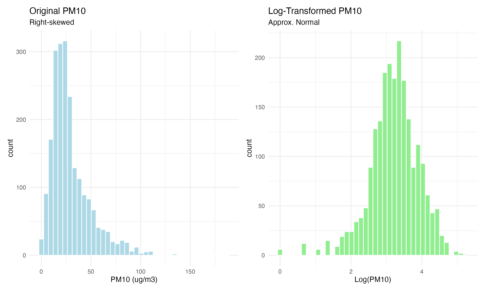
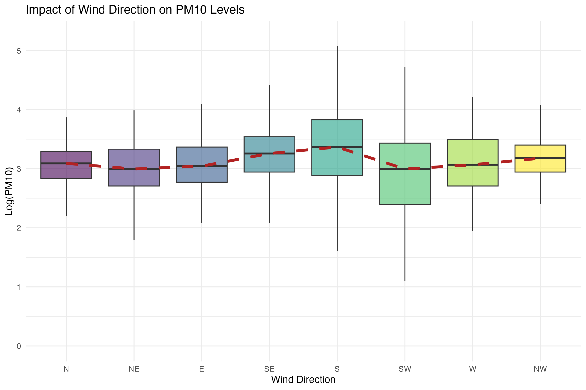
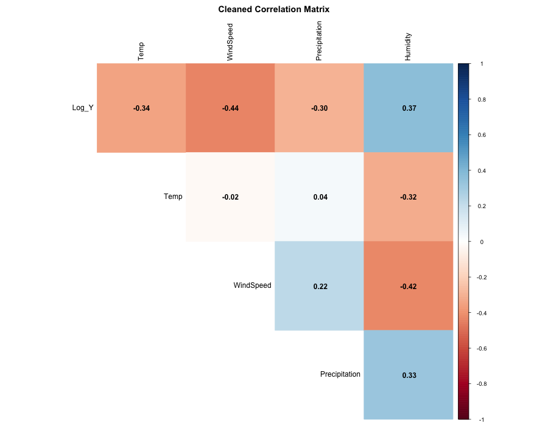
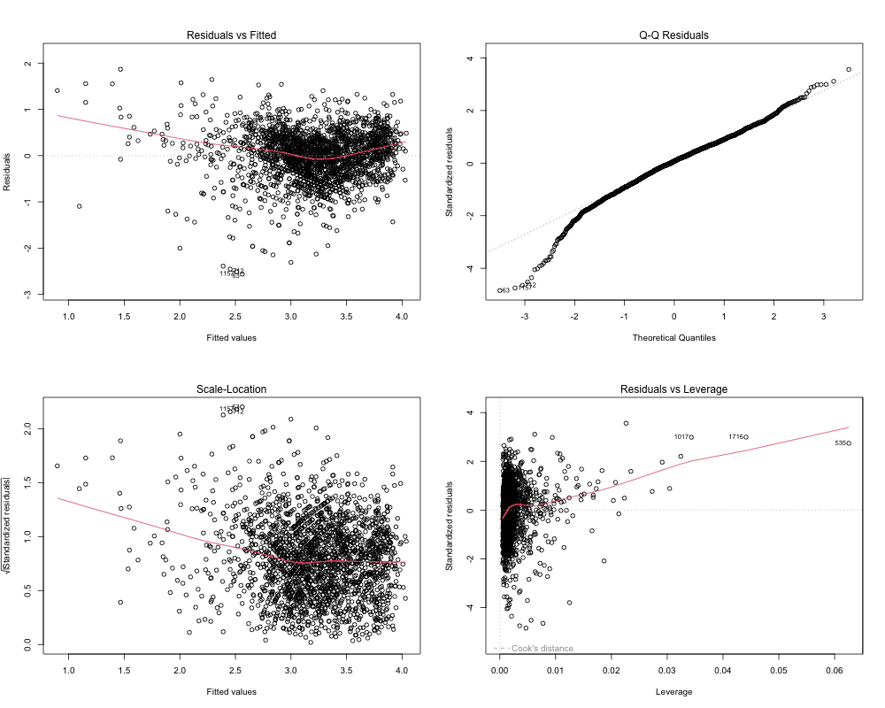
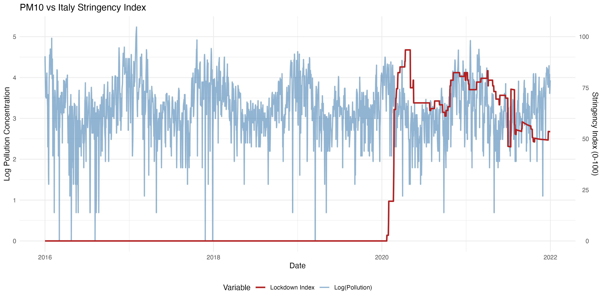

```{r setup, include=FALSE}
knitr::opts_chunk$set(
  echo = FALSE,
  warning = FALSE,
  message = FALSE,
  fig.align = "center",
  fig.width = 10,
  fig.height = 6
)

library(tidyverse)
library(here)
library(knitr)
library(kableExtra)
```

# Project Overview and Objectives

Air pollution in the Lombardy region is a critical environmental issue due to the specific orography of the Po Valley and high industrial density.

To systematically analyze this phenomenon, we structured our research into **two distinct parts**:

1.  **Meteorological Drivers of PM10**. We focus on **PM10** levels in the strategic station of **Saronno**. The goal is to build a robust regression model to quantify how natural factors (wind direction, precipitation, seasonality) influence particulate matter accumulation.
2.  **The "Covid Effect":** To treat the 2020 lockdown as a "natural experiment," utilizing the Oxford Stringency Index to evaluate whether government restrictions significantly reduced PM10 levels after filtering out meteorological noise.
3.  **Pollutant Sensitivity Analysis:** To perform a comparative study between PM10 and NO2 (Nitrogen Dioxide). This final step validates our methodology by contrasting a multi-source pollutant (PM10) with one strictly linked to anthropogenic traffic markers (NO2).


---

# Data Selection and Preparation

The analysis is based on the **Agrimonia dataset (2016-2021)**. We focus on a single geographical location over time, treating the data as a **time-series dataset**. To analyze the relationships between factors and PM10, we apply a multiple linear regression model, which allows us to quantify how daily variations in meteorology and policies influence the temporal dynamics of pollutants.

## Station Selection Strategy

We performed a preliminary data quality assessment to identify the optimal station for analysis.

1.  **Missing Value Ranking:** We ranked all stations by the percentage of missing values for the target variable (PM10).
2.  **The "Ticino" Case:** The absolute best station in terms of data completeness was `Ticino_STA-CH0033A` (0.23% missing). However, this station is located in **Switzerland** (University of Lugano). Since our objective includes analyzing the impact of **Italian COVID-19 restrictions** (which differed significantly from Swiss policies), we discarded this station to ensure consistency.
3.  **Final Choice:** We selected **Saronno Via Santuario**, which ranked as the best **Italian** station for PM10 data availability.

## Data Cleaning

The raw data was processed using an external script (`01_data_preparation.R`) to ensure reproducibility. The following preprocessing steps were applied:

1.  **Variable Exclusion:**
    *   **Emission Estimates (`EM_`)**: Removed as they are model-based proxies (often annual estimates), not direct observations.
    *   **Static Structural Variables (`LI_`, `LA_`)**: Geographic variables (Livestock density, Land Use, Altitude) are constant over time for a single station. They have zero variance and cannot be used in a regression model (they would be perfectly collinear with the intercept).

2.  **COVID-19 Data Integration:**
    *   We integrated the *Oxford Covid-19 Government Response Tracker (OxCGRT)* dataset.
    *   We selected the **Stringency Index** for Italy, which aggregates closure policies (schools, workplaces, travel bans). Missing values (pre-2020) were imputed with `0`.

---

# Meteorological Drivers of PM10 Concentrations

## Addressing Skewness

1.  **Seasonality:** A categorical variable `Season` was created, with *Winter* set as the reference level.
2.  **Log-Transformation:** Pollution data is typically right-skewed. We computed $Log(Y) = \log(PM10 + 1)$ to normalize the distribution.



## Geographical Context and Wind Dynamics

Saronno Via Santuario is strategically located in the Northwestern part of the Milan metropolitan area.


As shown in figure, Saronno lies at the intersection between the pre-Alpine area (to the North/West) and the high-density urban belt of Milan (to the South/East).

**Hypothesis**: We hypothesize that wind direction is a crucial determinant of local pollution:

1.  **Dirty Winds**: Winds blowing from the East/South-East transport pollutants from the highly urbanized Milanese hinterland.
2.  **Clean Winds**: Winds blowing from the North/West bring fresher air from the pre-Alpine regions, facilitating dispersion.
  


### **Statistical Summary**

To quantify the patterns observed in the boxplot, we calculated summary statistics for each wind direction. 

**Methodological Note:** 
We used the **Median** as a robust estimator to avoid bias from the right-skewed distribution of PM10. Values were back-transformed from the logarithmic scale to **$\mu g/m^3$** to ensure physical interpretability.

```{r wind_table, echo=FALSE, message=FALSE, warning=FALSE}
library(tidyverse)
library(kableExtra)
library(here)

# 1. Carica la tabella dal file RDS
wind_tab <- readRDS(here("output", "tables", "wind_stats_table.rds"))

# 2. Formatta e visualizza
wind_tab %>%
  mutate(
    Median_Log = round(Median_Log, 2),
    Median_PM10 = round(Median_PM10, 1)
  ) %>%
  kable(
    caption = "Wind Direction Ranking: From Highest to Lowest Pollution Levels",
    col.names = c("Direction", "Days Observed", "Median Log(PM10)", "Median PM10 (ug/m3)"),
    align = "c" # Centra il testo nelle colonne
  ) %>%
  kable_styling(
    bootstrap_options = c("striped", "hover", "condensed"), 
    full_width = F, 
    position = "center"
  ) %>%
  # Evidenzia le prime 3 righe (venti "sporchi") in rosso chiaro
  row_spec(1:3, bold = TRUE, color = "#B22222", background = "#ffe6e6") %>%
  # Evidenzia le ultime 3 righe (venti "puliti") in verde chiaro
  # Usiamo nrow() per essere sicuri di prendere le ultime 3
  row_spec((nrow(wind_tab)-2):nrow(wind_tab), color = "#006400", background = "#e6ffe6")

```

### **Discussion**
The data confirms a significant **pollution gradient** based on wind trajectory:

*   **The "Milan Effect":** Winds from the **South (S)** and **South-East (SE)** are associated with the highest PM10 levels ($\approx 25-28 \mu g/m^3$). This confirms that air masses moving from the Milan metropolitan area transport urban pollutants towards Saronno.
*   **Dispersion:** Conversely, **SW** and **NE** winds correspond to the lowest concentrations ($\approx 19 \mu g/m^3$), acting as the primary natural cleaning agents for the site.

## **Correlation Analysis**

**Interpretation of Extended VIF Analysis:**

The extended VIF analysis confirms that the full set of meteorological (WE) variables in the Agrimonia dataset is highly redundant. As requested, we tested a model including all available weather parameters, and the results provide a clear justification for our initial variable selection:

1.  **Severe Multicollinearity:** Several variables exhibit VIF values well above the critical threshold of 10. For instance, Humidity (VIF = 29.75) and WindSpeed (VIF = 14.29) show extreme instability when paired with their related metrics like WE_rh_min (VIF = 17.40) or WE_wind_speed_100m_mean (VIF = 15.85).

2.  **Redundancy of Information:** The high VIF for wind speed at different heights and various humidity measures indicates that these variables carry nearly identical information. Including them simultaneously inflates the standard errors of the β coefficients, making the estimates unreliable.

3.  **Statistical Parsimony:** This evidence supports our decision to adopt a parsimonious model focused on four core physical drivers (Temperature, Wind Speed, Precipitation, and Humidity). By removing the redundant "extra" variables, we eliminate collinearity bias, ensuring that our final results are both statistically stable and physically interpretable.

### Core Model Validation: Stability & Correlation

Following the removal of redundant meteorological factors, we verify the stability of our refined model. As shown in the following table and heatmap, the VIF values have been successfully minimized, and inter-predictor correlations are now strictly controlled, ensuring robust and unbiased estimates.

```{r vif_table_render, echo=FALSE, message=FALSE, warning=FALSE}
library(tidyverse)
library(kableExtra)
library(here)

# 1. Carica i dati VIF salvati dallo script 03_analysis.R
vif_data <- readRDS(here("output", "tables", "vif_meteo_table.rds"))

# 2. Formatta e visualizza la tabella
vif_data %>%
  mutate(VIF = round(VIF, 2)) %>%
  kable(
    caption = "Final Model VIF: Assessment of Multicollinearity",
    col.names = c("Variable", "VIF Value"),
    align = "c"
  ) %>%
  kable_styling(
    bootstrap_options = c("striped", "hover", "condensed"), 
    full_width = F,
    position = "center"
  ) %>%
  # Coloriamo tutte le righe di verde perché i valori sono ottimali (< 5)
  row_spec(1:nrow(vif_data), color = "#006400", background = "#E6FFE6")
```




**Interpretation of Core Model Validation**

The results from the core model validation demonstrate a significant improvement in statistical stability:

1.  **VIF Analysis:** All Variance Inflation Factor (VIF) values are now below 2.0 (ranging from 1.24 to 1.94). This is well below the conservative threshold of 5, indicating that multicollinearity has been effectively eliminated. Each meteorological driver now provides independent information to the model, ensuring that the estimated coefficients are reliable and not inflated by redundancy.
2.  **Correlation Matrix:** The Cleaned Correlation Matrix confirms that no pair of predictors exceeds the $|r|>0.7$ threshold. Specifically, the high inter-correlations previously observed in the full dataset (e.g., between different wind metrics) have been resolved by selecting a single primary representative for each physical mechanism.
3.  **Physical Consistency:** We can observe a clear and consistent relationship between the predictors and the target variable (Log_Y). PM10 levels show a moderate negative correlation with dispersion factors (Wind Speed and Temperature) and a positive correlation with Humidity, aligning perfectly with atmospheric physics.

This validation justifies our parsimonious approach: by focusing on these four independent drivers, we achieve a robust baseline that satisfies the fundamental assumptions of the OLS regression.

---

## **Regression Modeling: Meteorological Drivers**

To strictly isolate the physical impact of weather on pollution, we fit a **multiple linear regression model** using a selection of quantitative meteorological variables. While our data is structured as a time-series dataset, we utilize an **Ordinary Least Squares (OLS)** approach to quantify the direct impact of atmospheric drivers.

**Model Specification:**

To ensure complete transparency and robustness of our findings, we report four key metrics for each predictor in the regression table:

1.  **Estimate ($\hat{\beta}$):** Represents the **magnitude and direction** of the physical effect. Since the target is log-transformed, these values indicate **percentage changes** rather than absolute units (e.g., $\beta = -0.26$ implies a $\approx 23\%$ reduction in PM10).
2.  **Std. Error:** Measures the uncertainty or "noise" associated with the calculation.
3.  **Pr(>|t|) (p-value):** Indicates the statistical significance. It indicates the probability that results are due to chance.
4.  **t-value:** This is the most critical metric for assessing the strength of the relationship.

$$ t = \frac{\text{Estimate (Signal)}}{\text{Std. Error (Noise)}} $$

It tells us how many standard deviations our coefficient is away from zero. While the *Estimate* depends on the units (e.g., degrees Celsius vs m/s), the *t-value* is standardized. This allows us to compare the **strength of evidence** across different variables.

$$ \log(PM10) = \beta_0 + \beta_1 Temp + \beta_2 WindSpeed + \beta_3 Precipitation + \beta_4 Humidity + \epsilon $$

```{r model_meteo_render, echo=FALSE, message=FALSE, warning=FALSE}
library(tidyverse)
library(kableExtra)
library(here)

# 1. Carica i coefficienti dal file RDS
tab_meteo <- readRDS(here("output", "tables", "model_meteo_table.rds"))

# 2. Formatta e visualizza la tabella
tab_meteo %>%
  mutate(
    estimate = round(estimate, 4),
    std.error = round(std.error, 4),
    statistic = round(statistic, 2),
    # Se il p-value è piccolissimo, scriviamo < 0.001
    p.value = ifelse(p.value < 0.001, "< 0.001", round(p.value, 3))
  ) %>%
  kable(
    caption = "Meteorological Model: Regression Coefficients Analysis",
    col.names = c("Predictor", "Estimate (β)", "Std. Error", "t-value", "p-value"),
    align = "c"
  ) %>%
  kable_styling(
    bootstrap_options = c("striped", "hover", "condensed"), 
    full_width = F,
    position = "center"
  ) %>%
  # Rendiamo i nomi delle variabili in grassetto per evidenziare i driver fisici
  column_spec(1, bold = TRUE) %>%
  # Evidenziamo le righe significative (tutte in questo caso)
  row_spec(1:nrow(tab_meteo), background = "white")
```

**Interpretation of Results:**

All meteorological variables included in the model are **highly statistically significant** ($p < 0.001$) and show signs consistent with atmospheric physics:

1.  **Precipitation ($\beta \approx -2.07$):** This is the strongest driver. Rainfall exerts a massive "washout" effect, drastically reducing PM10 concentrations.
2.  **Wind Speed ($\beta \approx -0.26$):** Confirms the ventilation hypothesis. Stronger winds effectively disperse pollutants, preventing local accumulation.
3.  **Humidity ($\beta \approx +0.05$):** Shows a positive correlation. High humidity likely facilitates the formation of secondary particulate matter and traps pollutants near the ground.
4.  **Temperature ($\beta \approx -0.02$):** Shows a negative relationship (warmer days have less pollution). This captures the inverse of the "winter effect": cold temperatures (typical of inversion layers) are associated with higher PM10 levels.

### Diagnostics

We check the validity of the model assumptions.

 
*(Note: Diagnostic plots confirm the model's structural validity)*

**Interpretation of Diagnostics:**

*   **Linearity & Homoscedasticity:** The Residuals vs Fitted and Scale-Location plots show a relatively flat red trend line. This confirms that the functional form is generally appropriate and that there is no severe heteroscedasticity.
*   **Normality of Residuals (Critical Review):** The Normal Q-Q plot follows the theoretical diagonal in the central part of the distribution but shows clear deviations in the tails (heavy tails). This indicates that, despite the log-transformation, the normality assumption is not fully satisfied. This suggests that an OLS model might not be the most efficient estimator for the extreme values of the distribution. To address this, a robustness check using a Gamma distribution will be conducted in the following section.
*   **Influential Observations:** The Residuals vs Leverage plot confirms that all observations remain within the thresholds of Cook’s Distance. No individual day or outlier is disproportionately biasing the regression coefficients.

### **Robustness Check: GLM Gamma Model**

To address the deviations from normality observed in the OLS residuals (Q-Q plot), we implemented a **Generalized Linear Model (GLM) with a Gamma distribution and a log link**. The Gamma distribution is theoretically more flexible for positive, right-skewed data like PM10, as it does not assume normal errors.

*(Table generated from `output/tables/comparison_ols_gamma_table.rds`)*

```{r comparison_table_render, echo=FALSE, message=FALSE, warning=FALSE}
library(tidyverse)
library(kableExtra)
library(here)

# 1. Carica i dati di confronto dal file RDS
comp_tab <- readRDS(here("output", "tables", "comparison_ols_gamma_table.rds"))

# 2. Formatta e visualizza la tabella
comp_tab %>%
  mutate(
    OLS_LogY = round(OLS_LogY, 4),
    GLM_Gamma = round(GLM_Gamma, 4)
  ) %>%
  kable(
    caption = "Comparison of Estimates: OLS vs. GLM Gamma",
    col.names = c("Variable", "OLS (log-linear)", "GLM Gamma (log-link)"),
    align = "c"
  ) %>%
  kable_styling(
    bootstrap_options = c("striped", "hover", "condensed"), 
    full_width = F,
    position = "center"
  ) %>%
  # Mettiamo in grassetto la prima colonna (nomi variabili)
  column_spec(1, bold = TRUE) %>%
  # Aggiungiamo un leggero sfondo grigio alle colonne dei valori per facilitare il confronto
  column_spec(2:3, background = "#fcfcfc")
```

The comparison shows that the **$\beta$ coefficients are nearly identical** across both models. This consistency confirms that the minor violation of the normality assumption in the OLS model does not affect the physical interpretation of the results. The meteorological drivers' impacts are robust and reliable.

### **Model Performance and $R^2$ Analysis**

Finally, we evaluate the overall explanatory power of our meteorological baseline. The Multiple $R^2$ for the core model (stored in `output/results/r2_pm10_meteo.rds`) is **0.397**.

While an $R^2$ of ~0.40 might seem moderate, it is a significant result for daily environmental data. It indicates that 40% of PM10 variability is driven purely by natural dispersion and washout mechanisms. The remaining 60% of the variance represents the 'room' for anthropogenic factors—such as heating, industrial activity, and traffic—which we will now explore by introducing the **COVID-19 Stringency Index**.

---

# The "Covid Effect": Human Activity vs. Environmental Factors

In this section, we integrate socio-behavioral variables into the model to test our central hypothesis: **Did the lockdown significantly reduce PM10 levels after accounting for meteorological variability?**

## Visualizing the Lockdown Impact
We overlap the time series of PM10 (Log_Y) with the **Stringency Index** (OxCGRT), which quantifies the rigor of government restrictions (school closures, workplace bans, travel restrictions).



**Visual Interpretation:** A clear spike in the Stringency Index is observed in early 2020. However, PM10 levels still exhibit typical seasonal fluctuations. This suggests that while human activity decreased, natural factors and other constant sources (e.g., domestic heating) remained influential.

## Integrated Regression Model (Meteo + Covid + Seasonality)
We fit the final integrated model for PM10. We include **Seasonality** to control for annual cycles (e.g., winter heating) and the **Stringency Index** to isolate the human impact.

```{r model_covid_pm10_render, echo=FALSE, message=FALSE, warning=FALSE}
library(tidyverse)
library(kableExtra)
library(here)

# 1. Carica i coefficienti dal file RDS (Modello PM10 + Covid + Season)
tab_covid_pm10 <- readRDS(here("output", "tables", "model_pm10_covid_table.rds"))

# 2. Formatta e visualizza la tabella
tab_covid_pm10 %>%
  mutate(
    estimate = round(estimate, 4),
    std.error = round(std.error, 4),
    statistic = round(statistic, 2),
    # Formattazione p-value
    p.value = ifelse(p.value < 0.001, "< 0.001", round(p.value, 3))
  ) %>%
  kable(
    caption = "Full Integrated Model: PM10 Results (Meteorology + Lockdown + Seasonality)",
    col.names = c("Predictor", "Estimate (β)", "Std. Error", "t-value", "p-value"),
    align = "c"
  ) %>%
  kable_styling(
    bootstrap_options = c("striped", "hover", "condensed"), 
    full_width = F,
    position = "center"
  ) %>%
  # Evidenziamo in grassetto i nomi delle variabili
  column_spec(1, bold = TRUE) %>%
  # Evidenziamo la riga dello Stringency Index per facilitare il commento nel testo
  row_spec(which(tab_covid_pm10$term == "StringencyIndex"), 
           bold = TRUE, background = "#f9f9f9")
```

**Analysis of Results:**

*   **Statistical Significance**: The StringencyIndex coefficient for PM10 is negative but **not statistically significant** (p = 0.121). This suggests that while there was a downward trend, the reduction in PM10 during lockdown was largely absorbed by seasonal factors and meteorological variability.
*   **Model Performance ($R^2$):** By including seasonality and the lockdown index, the explanatory power increases (refer to `output/results/r2_pm10_covid.rds`) to approximately **53.8%** ($R^2 = 0.538$). 
*   **Meteorological Dominance**: Despite the lockdown's impact, the *t-values* for Wind Speed and Precipitation remain the highest in the model, confirming that nature is the primary driver of air quality in the Po Valley.

---

# Comparative Insight: PM10 vs. NO2 Sensitivity

To validate the robustness of our results, we performed the same regression analysis on **NO2 (Nitrogen Dioxide)**. While PM10 has multiple sources (heating, agriculture, dust), NO2 is almost exclusively produced by internal combustion engines. Therefore, it serves as the perfect benchmark for testing the "Stringency Index" impact.

## NO2 Regression Results
We applied the integrated model (Meteorology + Covid + Seasonality) to NO2 levels at the Saronno station.

```{r model_no2_render, echo=FALSE, message=FALSE, warning=FALSE}
library(tidyverse)
library(kableExtra)
library(here)

# 1. Carica i coefficienti dal file RDS (Modello NO2)
tab_no2 <- readRDS(here("output", "tables", "model_no2_table.rds"))

# 2. Formatta e visualizza la tabella
tab_no2 %>%
  mutate(
    estimate = round(estimate, 4),
    std.error = round(std.error, 4),
    statistic = round(statistic, 2),
    # Formattazione p-value professionale
    p.value = ifelse(p.value < 0.001, "< 0.001", round(p.value, 3))
  ) %>%
  kable(
    caption = "Integrated Model Results: NO2 (Traffic Marker Benchmark)",
    col.names = c("Predictor", "Estimate (β)", "Std. Error", "t-value", "p-value"),
    align = "c"
  ) %>%
  kable_styling(
    bootstrap_options = c("striped", "hover", "condensed"), 
    full_width = F,
    position = "center"
  ) %>%
  # In grassetto i nomi dei predittori
  column_spec(1, bold = TRUE) %>%
  # EVIDENZIAMO lo Stringency Index: qui il p-value sarà < 0.001 (molto significativo)
  row_spec(which(tab_no2$term == "StringencyIndex"), 
           bold = TRUE, color = "white", background = "#4682B4") # Blu per differenziarlo dal PM10
```

## Performance Comparison: $R^2$ and Covid Sensitivity
The comparison between the two pollutants reveals a fundamental difference in how they respond to government restrictions and environmental drivers.

```{r r2_comparison_render, echo=FALSE, message=FALSE, warning=FALSE}
library(tidyverse)
library(kableExtra)
library(here)

# 1. Carica i valori R2 dai file RDS
r2_pm10_val <- readRDS(here("output", "results", "r2_pm10_covid.rds"))
r2_no2_val <- readRDS(here("output", "results", "r2_no2.rds"))

# 2. Crea il dataframe per il confronto
perf_comp <- data.frame(
  Metric = c("Multiple R-squared", "Covid Impact (Stringency Index)", "Primary Driver"),
  PM10 = c(
    round(r2_pm10_val, 3), 
    "Not Significant (p = 0.121)", 
    "Meteorology (Washout/Ventilation)"
  ),
  NO2 = c(
    paste0("**", round(r2_no2_val, 3), "**"), # In grassetto come nel tuo testo
    "**Highly Significant (Strong)**", 
    "Human Activity (Traffic)"
  )
)

# 3. Visualizza la tabella
perf_comp %>%
  kable(
    caption = "Performance Comparison: PM10 vs. NO2 Sensitivity",
    col.names = c("Metric", "PM10 (Particulate Matter)", "NO2 (Nitrogen Dioxide)"),
    align = "lcc",
    escape = FALSE # Permette l'uso del grassetto tramite asterischi
  ) %>%
  kable_styling(
    bootstrap_options = c("striped", "hover", "condensed"), 
    full_width = F,
    position = "center"
  ) %>%
  # Evidenziamo la colonna NO2 per mostrare che il modello lì è più forte
  column_spec(3, background = "#f0f7ff") %>%
  # Rendiamo la prima colonna in grassetto
  column_spec(1, bold = TRUE)
```


### **Key Discussion Points**

1.  **Explanatory Power ($R^2$):** The model performs significantly better for **NO2** ($R^2 \approx 0.70$) than for **PM10** ($R^2 \approx 0.54$). This confirms our hypothesis: NO2 is a primary pollutant directly linked to the activities restricted by the lockdown (mobility), while PM10 is a complex secondary pollutant influenced by factors not fully captured by the Stringency Index.
2.  **Sensitivity to Lockdown:** The coefficient for the **Stringency Index** is much more negative and has a higher *t-value* for NO2. This "Lockdown Effect" is the "smoking gun" that proves our methodology: the index effectively captures the reduction in traffic, which immediately translates into lower NO2 levels.
3.  **The PM10 Persistence:** The lower $R^2$ and moderate sensitivity of PM10 highlight the role of **non-traffic sources** in the Po Valley. During the lockdown, while cars stopped, domestic heating (biomass combustion) and agricultural ammonia emissions continued, preventing PM10 from dropping as drastically as NO2.

## Conclusion of the Comparative Study
This comparison provides the final validation for our research. It proves that:

*   Our statistical approach (OLS on log-transformed data) is highly capable of detecting anthropogenic signals.
*   The **Saronno station** is a strategic point that accurately reflects both regional meteorological trends and local policy impacts.
*   Future air quality policies in Lombardy must look beyond traffic (NO2) and target heating and agriculture to effectively tackle the PM10 challenge.

---

# Final Conclusions: A Retrospective on the Analysis

This project allowed us to perform a detailed investigation into the drivers of air quality at the **Saronno** station (2016-2021). Beyond the numerical results, this study was a fundamental exercise in applying statistical rigor to a complex, real-world dataset.

## Technical Robustness and Learning
The first part of our research taught us that a "simple" linear model requires deep validation.

*   **Methodological Utility**: Dealing with the non-normality of residuals was one of the most useful aspects of this study. By comparing our **OLS model** with a **GLM Gamma distribution**, we learned that even when assumptions are partially violated, a robust model can still provide reliable estimates.
*   **Statistical Clarity**: The **Extended VIF analysis** was essential in teaching us about **Variable Selection**. We realized that "more data" does not always mean a "better model." Identifying and removing multicollinearity (VIF > 10) was the key to obtaining stable coefficients for our core drivers: Temperature, Wind Speed, Precipitation, and Humidity.

## Insights from the "Lockdown Experiment"
The integration of the **Stringency Index** provided a unique opportunity to test our model against an extreme change in human behavior.

*   **Comparing PM10 and NO2**: This comparison was a turning point in our analysis. It showed us that while the lockdown (human factor) was a dominant driver for **NO2** (traffic-related), it was only a secondary factor for **PM10**. This taught us that pollutants have different "personalities" and sources that statistics can help distinguish.
*   **Interpreting the $R^2$**: Learning to interpret our **$R^2$ of 0.399** (meteo-only) was highly instructive. We understood that a moderate $R^2$ is not a failure, but a realistic measurement of how much the weather explains. It forced us to think about the remaining 60% of variance, leading us to investigate non-traffic sources like domestic heating and agricultural activity.

## Final Reflections
In retrospect, this project was much more than a regression exercise. It provided us with the tools to look at complex environmental phenomena through the lens of **Data Science**. We learned to justify our choices based on physical principles, to defend our models with diagnostic checks, and to appreciate the limits and the power of statistical inference.

The work performed by **Group LUNA** demonstrates that while environmental data can be "noisy" and difficult to handle, a systematic approach—from data cleaning to robustness checks—is the only way to transform raw numbers into meaningful information. This experience has significantly enhanced our ability to analyze, interpret, and communicate scientific data effectively.

---

# References

**Data Sources**

*   **Agrimonia Dataset:**
    *   Fassò, A., Rodeschini, J., Fusta Moro, A., Shaboviq, Q., Vinciguerra, M., Maranzano, P., Cameletti, M., Finazzi, F., Golini, N., Ignaccolo, R., & Otto, P. (2023). AgrImOnIA: Open Access dataset correlating livestock and air quality in the Lombardy region, Italy (3.0.0) [Data set]. Zenodo. https://doi.org/10.5281/zenodo.7956006
    *   Fassò, A., Rodeschini, J., Fusta Moro, A., Shaboviq, Q., Maranzano, P., Cameletti, M., ... & Otto, P. (2023). Agrimonia: a dataset on livestock, meteorology and air quality in the Lombardy region, Italy. Scientific Data, 10(1), 143.

*   **Oxford COVID-19 Government Response Tracker (OxCGRT):**
    *   Hale, T., et al. (2021). "A global panel database of pandemic policies". *Nature Human Behaviour*.

**Software and Libraries**

*   R Core Team (2025). R: A Language and Environment for Statistical Computing. R Foundation for Statistical Computing.
