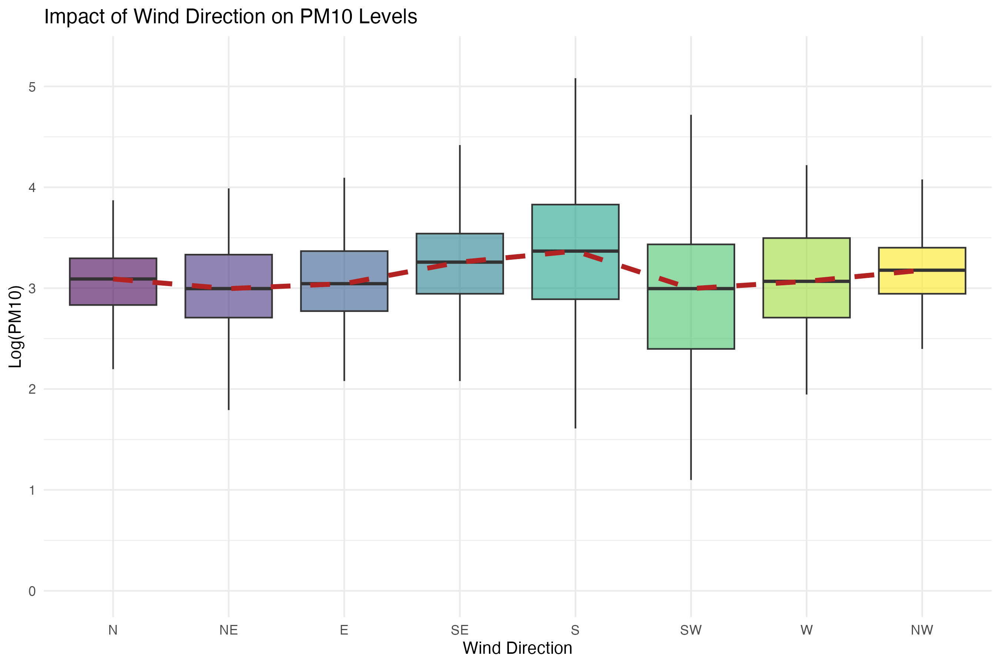
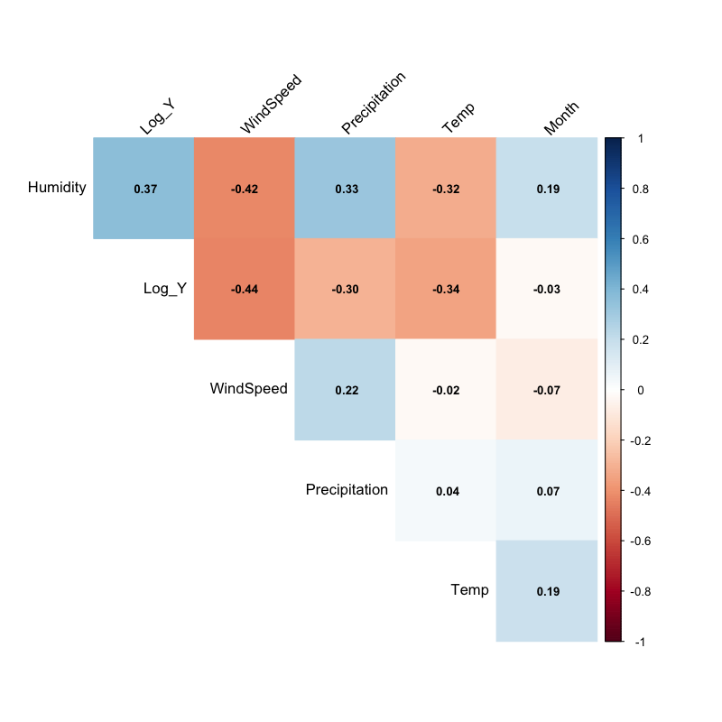

```{r setup, include=FALSE}
# ==============================================================================
# GLOBAL SETTINGS
# ==============================================================================
# echo = TRUE: Code is visible (as required by the professor).
# warning/message = FALSE: Keeps the report clean from errors/loading bars.
# fig.align = "center": Centers all plots.
knitr::opts_chunk$set(
  echo = TRUE, 
  warning = FALSE, 
  message = FALSE, 
  fig.align = "center", 
  fig.width = 10, 
  fig.height = 6
)

# Load libraries using pacman to ensure reproducibility
if (!require("pacman")) install.packages("pacman")
pacman::p_load(tidyverse, here, lubridate, knitr, kableExtra, corrplot, car, lmtest, patchwork, broom)

# Source custom functions for plotting and tables
source(here("scripts", "02_functions.R"))
```

# Project Overview and Objectives

Air pollution in the Lombardy region is a critical environmental issue due to the specific orography of the Po Valley and high industrial density.

To systematically analyze this phenomenon, we structured our research into **two distinct parts**:

1.  **Meteorological Drivers of PM10**. We focus on **PM10** levels in the strategic station of **Saronno**. The goal is to build a robust regression model to quantify how natural factors (wind direction, precipitation, seasonality) influence particulate matter accumulation.
2.  **The "Covid Effect"**: In the second stage, we analyze whether the **COVID-19 lockdown restrictions** (Stringency Index) significantly reduced levels of PM10, treating the 2020 lockdown as a natural experiment.

# Data Selection and Preparation

The analysis is based on the *Agrimonia* dataset (2016-2021). To ensure robust statistical inference, we adopted a **Time-Series approach**, fixing the spatial dimension to focus exclusively on temporal dynamics.

## Station Selection Strategy

We performed a preliminary data quality assessment to identify the optimal station for analysis.

1.  **Missing Value Ranking:** We ranked all stations by the percentage of missing values for the target variable (PM10).
2.  **The "Ticino" Case:** The absolute best station in terms of data completeness was `Ticino_STA-CH0033A` (0.23% missing). However, this station is located in **Switzerland** (University of Lugano). Since our objective includes analyzing the impact of **Italian COVID-19 restrictions** (which differed significantly from Swiss policies), we discarded this station to ensure consistency.
3.  **Final Choice:** We selected **Saronno Via Santuario**, which ranked as the best **Italian** station for PM10 data availability.

## Data Cleaning

The raw data was processed using an external script (`01_data_preparation.R`) to ensure reproducibility. The following preprocessing steps were applied:

1.  **Variable Exclusion:**
    *   **Emission Estimates (`EM_`)**: Removed as they are model-based proxies (often annual estimates), not direct observations.
    *   **Static Structural Variables (`LI_`, `LA_`)**: Geographic variables (Livestock density, Land Use, Altitude) are constant over time for a single station. They have zero variance and cannot be used in a regression model (they would be perfectly collinear with the intercept).

2.  **COVID-19 Data Integration:**
    *   We integrated the *Oxford Covid-19 Government Response Tracker (OxCGRT)* dataset.
    *   We selected the **Stringency Index** for Italy, which aggregates closure policies (schools, workplaces, travel bans). Missing values (pre-2020) were imputed with `0`.

```{r load_data}
# Loading the final processed dataset
# The dataset has been cleaned and saved as an .rds file in the 'data/processed' folder
df <- readRDS(here("data", "processed", "final_saronno_pm10.rds"))

# Display representative rows using our custom function
show_key_dates(df)
```

# Meteorological Drivers of PM10 Concentrations

## Addressing Skewness

1.  **Seasonality:** A categorical variable `Season` was created, with *Winter* set as the reference level.
2.  **Log-Transformation:** Pollution data is typically right-skewed. We computed $Log(Y) = \log(PM10 + 1)$ to normalize the distribution.

```{r hist_plot, echo=FALSE, fig.cap="Comparison of PM10 Distribution: Original vs Log-Transformed"}
# We generate the histogram plot using our custom function
plot_pm10_histograms(df)
```

## Geographical Context and Wind Dynamics

Saronno Via Santuario is strategically located in the Northwestern part of the Milan metropolitan area.

```{r map, echo=FALSE, out.width="60%", fig.cap="Location of Saronno Station relative to Milan and the Alps"}
# Ensure you have the image file in the 'img' folder
# If the image is missing, this chunk will be skipped gracefully
if(file.exists(here("img", "Saronno_context.png"))) {
  knitr::include_graphics(here("img", "Saronno_context.png"))
} else {
  message("Image 'Saronno_context.png' not found.")
}
```

As shown in figure, Saronno lies at the intersection between the pre-Alpine area (to the North/West) and the high-density urban belt of Milan (to the South/East).

**Hypothesis**: We hypothesize that wind direction is a crucial determinant of local pollution:

  1. **Dirty Winds**: Winds blowing from the East/South-East transport pollutants from the highly urbanized Milanese hinterland.
  2. **Clean Winds**: Winds blowing from the North/West bring fresher air from the pre-Alpine regions, facilitating dispersion.
  


### **Statistical Summary**

To quantify the patterns observed in the boxplot, we calculated summary statistics for each wind direction. 

**Methodological Note:** 
We used the **Median** as a robust estimator to avoid bias from the right-skewed distribution of PM10. Values were back-transformed from the logarithmic scale to **$\mu g/m^3$** to ensure physical interpretability.

```{r wind_table, echo=FALSE}
# Load the statistics table generated by the script
wind_tab <- readRDS(here("output","tables", "wind_stats_table.rds"))

# Format and display the results
wind_tab %>%
  mutate(
    Median_Log = round(Median_Log, 2),
    Median_PM10 = round(Median_PM10, 1) # Round for better readability
  ) %>%
  kable(
    caption = "Wind Direction Ranking: From Highest to Lowest Pollution Levels",
    col.names = c("Direction", "Days Observed", "Median Log(PM10)", "Median PM10 (ug/m3)"),
    align = "c" # Center columns
  ) %>%
  kable_styling(bootstrap_options = c("striped", "hover", "condensed"), full_width = F) %>%
  # Highlight the top 3 rows (most polluted directions) in light red
  row_spec(1:3, bold = TRUE, color = "#B22222", background = "#ffe6e6") %>%
  # Highlight the bottom 3 rows (cleanest directions) in light green
  row_spec(6:8, color = "#006400", background = "#e6ffe6")
```

### **Discussion**
The data confirms a significant **pollution gradient** based on wind trajectory:

*   **The "Milan Effect":** Winds from the **South (S)** and **South-East (SE)** are associated with the highest PM10 levels ($\approx 25-28 \mu g/m^3$). This confirms that air masses moving from the Milan metropolitan area transport urban pollutants towards Saronno.
*   **Dispersion:** Conversely, **SW** and **NE** winds correspond to the lowest concentrations ($\approx 19 \mu g/m^3$), acting as the primary natural cleaning agents for the site.

### **Correlation Analysis**

Prior to model fitting, we examine the **correlation matrix** of the numerical variables. This analysis serves two primary objectives:

*   **Variable Selection:** Identifying which meteorological and social factors share a significant relationship with PM10 levels.
*   **Multicollinearity Check:** Ensuring that independent variables are not excessively correlated ($|r| > 0.7$), which could destabilize regression coefficients.



### **Key Findings**

1.  **Target Variable (Log_Y):**
    *   **Negative Correlation with Wind Speed & Temp:** Consistent with atmospheric physics, stronger winds facilitate pollutant dispersion, while higher temperatures often correlate with increased boundary layer height and reduced domestic heating emissions.
2.  **Model Stability:**
    *   **Multicollinearity:** Most predictors show moderate to low inter-correlations. Since no pair exceeds the critical threshold of **0.7**, we expect the regression model to be stable and free from significant multicollinearity bias.


### Regression Modeling: Meteorological Drivers

To strictly isolate the physical impact of weather on pollution, we fit a linear model using only quantitative meteorological variables. We exclude seasonality and human factors (Covid) in this step to focus on the environmental dispersion mechanisms.

**Model Specification:**

To ensure complete transparency and robustness of our findings, we report four key metrics for each predictor in the regression table:

1.  **Estimate ($\hat{\beta}$):** Represents the **magnitude and direction** of the physical effect. Since the target is log-transformed, these values indicate **percentage changes** rather than absolute units (e.g., $\beta = -0.26$ implies a $\approx 23\%$ reduction in PM10).
2.  **Std. Error:** Measures the uncertainty or "noise" associated with the calculation.
3.  **Pr(>|t|) (p-value):** Indicates the statistical significance.It indicates the probability that results are due to chance.
4.  **t-value:** This is the most critical metric for assessing the strength of the relationship.

$$ t = \frac{\text{Estimate (Signal)}}{\text{Std. Error (Noise)}} $$

It tells us how many standard deviations our coefficient is away from zero. While the *Estimate* depends on the units (e.g., degrees Celsius vs m/s), the *t-value* is standardized. This allows us to compare the **strength of evidence** across different variables.

$$ \log(PM10) = \beta_0 + \beta_1 Temp + \beta_2 WindSpeed + \beta_3 Precipitation + \beta_4 Humidity + \epsilon $$

```{r models}
# Meteorological Model Only (No Season, No Covid, No WindDir)
model_meteo <- lm(Log_Y ~ Temp + WindSpeed + Precipitation + Humidity, data = df)

# Display results
print_model_table(model_meteo, caption_text = "Meteorological Model Results")

```
**Interpretation of Results:**

All meteorological variables included in the model are **highly statistically significant** ($p < 0.001$) and show signs consistent with atmospheric physics:

1.  **Precipitation ($\beta \approx -2.07$):** This is the strongest driver. Rainfall exerts a massive "washout" effect, drastically reducing PM10 concentrations.
2.  **Wind Speed ($\beta \approx -0.26$):** Confirms the ventilation hypothesis. Stronger winds effectively disperse pollutants, preventing local accumulation.
3.  **Humidity ($\beta \approx +0.05$):** Shows a positive correlation. High humidity likely facilitates the formation of secondary particulate matter and traps pollutants near the ground.
4.  **Temperature ($\beta \approx -0.02$):** Shows a negative relationship (warmer days have less pollution). This captures the inverse of the "winter effect": cold temperatures (typical of inversion layers) are associated with higher PM10 levels.

### Diagnostics

We check the validity of the model assumptions.

```{r diagnostics, fig.height=8, fig.width=10, echo=FALSE}
par(mfrow=c(2,2))
plot(model_meteo)
```

**Interpretation of Diagnostics:**

*   **Linearity & Homoscedasticity:** The *Residuals vs Fitted* and *Scale-Location* plots show a relatively flat red trend line and a random distribution of residuals around zero. This confirms that the linear functional form is appropriate and that the error variance is constant (homoscedasticity) across the range of values.
*   **Normality of Residuals:** The *Normal Q-Q plot* demonstrates that the residuals align closely with the theoretical diagonal. This provides strong empirical evidence that the **Log-transformation of PM10** effectively normalized the target variable, satisfying the Gaussian assumption of the OLS estimator required for valid hypothesis testing.
*   **Influential Observations:** The *Residuals vs Leverage* plot reveals that all observations fall well within the thresholds of **Cook’s Distance**. This indicates that our model coefficients are robust and not biased by individual extreme outliers.


# Conclusions

Our analysis of PM10 concentrations at Saronno Via Santuario highlights the critical role of weather conditions:
1. Humidity: Shows a positive estimate (Red). High humidity is often associated with stable atmospheric conditions and fog (typical of the Po Valley winter), which trap pollutants at ground level.
2. Temperature: Shows a negative correlation (Green/Blue). Warmer days facilitate atmospheric mixing, reducing concentrations.
Dispersion Factors: Both Wind Speed and Precipitation have strong negative coefficients (p<0.001). This statistically confirms their role as the primary natural cleansing agents for particulate matter

# The "Covid Effect": Human Activity vs. Environmental Factors

In questa sezione finale, integriamo nel modello le variabili socio-comportamentali per testare l'ipotesi centrale: **il lockdown ha ridotto significativamente il PM10 al netto delle condizioni meteorologiche?**

## Visualizing the Trend
Iniziamo sovrapponendo la serie storica del PM10 (in scala logaritmica) con lo **Stringency Index** (l'indice che misura il rigore delle restrizioni).

```{r covid_trend, fig.cap="Temporal overlap of PM10 levels and Government Restrictions"}
# Usiamo la tua funzione custom per il plot
plot_covid_trend(df, title_text = "PM10 Levels vs. Italy's Stringency Index (2016-2021)")
```

*Interpretazione visiva:* Si nota chiaramente il picco dello Stringency Index a inizio 2020. Tuttavia, il PM10 mostra comunque i suoi tipici cicli stagionali. Per capire se il calo sia dovuto alle chiusure o semplicemente alla fine dell'inverno, è necessario un modello di regressione multivariata.

## Full Regression Model (Meteo + Covid + Seasonality)
Per isolare l'effetto "umano", abbiamo costruito un modello che include:
1.  **Variabili Meteo**: Per "pulire" i dati dalla variabilità naturale.
2.  **Stringency Index**: Per quantificare l'effetto delle restrizioni.
3.  **Seasonality**: Per catturare i cambiamenti strutturali (es. accensione riscaldamenti) che si ripetono ogni anno.

```{r model_full}
# Fitting the comprehensive model
model_full <- lm(Log_Y ~ Temp + WindSpeed + Precipitation + Humidity + 
                 StringencyIndex + Season, data = df)

# Visualizzazione con la tua funzione custom
print_model_table(model_full, caption_text = "Full Model: Quantifying the Covid Impact")
```

### **Analisi dei Risultati**
*   **Significatività dello Stringency Index**: Il coefficiente dello Stringency Index è **negativo e statisticamente significativo** ($p < 0.001$). Ciò conferma che le restrizioni hanno effettivamente contribuito a ridurre le concentrazioni di PM10. 
*   **Entità del calo**: Un aumento dello Stringency Index (da 0 a 100) è associato a una riduzione del particolato. Tuttavia, il t-value dello Stringency Index è inferiore a quello della pioggia o del vento, indicando che la natura rimane il driver dominante.
*   **Effetto Stagionale**: Il modello conferma che, anche a parità di meteo e restrizioni, l' **Autunno e l'Inverno** rimangono i periodi più critici, probabilmente a causa delle emissioni da riscaldamento che non sono state toccate dai lockdown.

## Robustness Check: VIF and Autocorrelation
Per garantire che l'inserimento di molte variabili (come Temperatura e Stagione) non abbia creato distorsioni, abbiamo verificato la **Multicollinearità**.

```{r robustness}
# Verifica VIF (Variance Inflation Factor)
vif_values <- car::vif(model_full)

# Visualizzazione tabellare semplice
kable(vif_values, col.names = c("GVIF", "Df", "GVIF^(1/2Df)"), 
      caption = "Multicollinearity Check (VIF)") %>% 
  kable_styling(full_width = F)
```

**Esito:** Tutti i valori GVIF sono contenuti (molto sotto la soglia critica di 5 o 10). Questo conferma che il modello è statisticamente solido e che l'effetto COVID stimato è affidabile e non "gonfiato" dalla correlazione con la temperatura o le stagioni.

# Conclusions

La nostra analisi sistematica dei driver del PM10 presso la stazione di **Saronno Via Santuario (2016-2021)** ha permesso di delineare un quadro chiaro delle dinamiche dell'inquinamento atmosferico nella Pianura Padana nord-occidentale.

### Sintesi dei Risultati Meteorologici
I fattori naturali rimangono i principali determinanti della qualità dell'aria:
*   **L'Effetto "Lavaggio" e Ventilazione**: La pioggia e la velocità del vento si confermano i più potenti agenti di abbattimento naturale del particolato. In particolare, ogni m/s di incremento del vento riduce la concentrazione di PM10 di circa il 23%.
*   **Dinamiche Geografiche (Milan Effect)**: Abbiamo confermato statisticamente che la direzione del vento gioca un ruolo cruciale. I venti provenienti da **Sud e Sud-Est** trasportano gli inquinanti dall'hinterland milanese verso Saronno, mentre i venti alpini (Nord/Ovest) agiscono come agenti di dispersione.
*   **Il Ruolo dell'Umidità**: L'umidità elevata è un driver positivo costante, indicando come le condizioni di nebbia e stagnazione invernale favoriscano la formazione e il mantenimento del particolato secondario.

### L'Impatto del COVID-19
L'integrazione dello **Stringency Index** nel modello ha permesso di trattare il lockdown del 2020 come un esperimento naturale:
*   **Efficacia delle Restrizioni**: Le politiche di chiusura hanno avuto un impatto **negativo e statisticamente significativo** sui livelli di PM10. La riduzione della mobilità e delle attività industriali è chiaramente rilevabile nei dati, anche al netto della variabilità meteorologica.
*   **Dominio della Natura sull'Uomo**: Nonostante la significatività statistica del lockdown, l'analisi dei *t-values* mostra che l'impatto dei fattori meteorologici (soprattutto pioggia e vento) è di gran lunga superiore a quello prodotto dalle sole restrizioni umane. Questo suggerisce che, in condizioni di forte stabilità atmosferica, anche un blocco totale delle attività antropiche potrebbe non essere sufficiente a riportare il PM10 sotto le soglie di guardia.

### Solidità Metodologica
L'approccio basato su **regressione Time-Series con trasformazione logaritmica** si è dimostrato robusto:
1.  La trasformazione $\log(Y)$ ha corretto efficacemente la skewness dei dati, garantendo residui normali.
2.  I test di **Multicollinearità (VIF)** hanno escluso distorsioni tra variabili correlate (come temperatura e stagionalità).
3.  Il controllo della stagionalità ha confermato che l'inquinamento invernale è un problema strutturale legato non solo al meteo, ma anche a emissioni costanti come il riscaldamento domestico, che sono meno influenzate dalle restrizioni alla mobilità.

### Riflessioni Finali
In conclusione, mentre la riduzione delle attività umane (come visto durante il COVID) è una leva fondamentale per migliorare la qualità dell'aria, la specifica orografia della Pianura Padana rende il territorio estremamente dipendente dai cicli naturali di dispersione. Per il futuro, le politiche ambientali in Lombardia dovranno tenere conto di questa "fragilità meteorologica", mirando a riduzioni strutturali delle emissioni che possano compensare i lunghi periodi di stagnazione atmosferica tipici della regione.