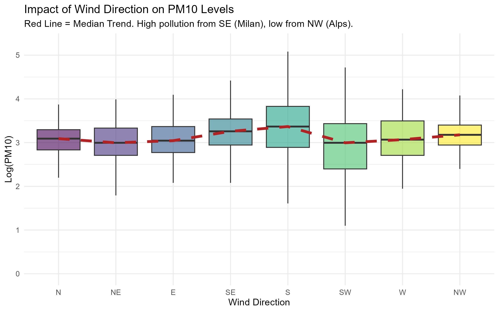

```{r setup, include=FALSE}
# ==============================================================================
# GLOBAL SETTINGS
# ==============================================================================
# echo = TRUE: Code is visible (as required by the professor).
# warning/message = FALSE: Keeps the report clean from errors/loading bars.
# fig.align = "center": Centers all plots.
knitr::opts_chunk$set(
  echo = TRUE, 
  warning = FALSE, 
  message = FALSE, 
  fig.align = "center", 
  fig.width = 10, 
  fig.height = 6
)

# Load libraries using pacman to ensure reproducibility
if (!require("pacman")) install.packages("pacman")
pacman::p_load(tidyverse, here, lubridate, knitr, kableExtra, corrplot, car, lmtest, patchwork, broom)

# Source custom functions for plotting and tables
source(here("scripts", "02_functions.R"))
```

# Project Overview and Objectives

Air pollution in the Lombardy region is a critical environmental issue due to the specific orography of the Po Valley and high industrial density.

To systematically analyze this phenomenon, we structured our research into **two distinct parts**:

1.  **Meteorological Drivers of PM10**. We focus on **PM10** levels in the strategic station of **Saronno**. The goal is to build a robust regression model to quantify how natural factors (wind direction, precipitation, seasonality) influence particulate matter accumulation.
2.  **The "Covid Effect"**: In the second stage, we analyze whether the **COVID-19 lockdown restrictions** (Stringency Index) significantly reduced levels of PM10, treating the 2020 lockdown as a natural experiment.

# Data Selection and Preparation

The analysis is based on the *Agrimonia* dataset (2016-2021). To ensure robust statistical inference, we adopted a **Time-Series approach**, fixing the spatial dimension to focus exclusively on temporal dynamics.

## Station Selection Strategy

We performed a preliminary data quality assessment to identify the optimal station for analysis.

1.  **Missing Value Ranking:** We ranked all stations by the percentage of missing values for the target variable (PM10).
2.  **The "Ticino" Case:** The absolute best station in terms of data completeness was `Ticino_STA-CH0033A` (0.23% missing). However, this station is located in **Switzerland** (University of Lugano). Since our objective includes analyzing the impact of **Italian COVID-19 restrictions** (which differed significantly from Swiss policies), we discarded this station to ensure consistency.
3.  **Final Choice:** We selected **Saronno Via Santuario**, which ranked as the best **Italian** station for PM10 data availability.

## Data Cleaning

The raw data was processed using an external script (`01_data_preparation.R`) to ensure reproducibility. The following preprocessing steps were applied:

1.  **Variable Exclusion:**
    *   **Emission Estimates (`EM_`)**: Removed as they are model-based proxies (often annual estimates), not direct observations.
    *   **Static Structural Variables (`LI_`, `LA_`)**: Geographic variables (Livestock density, Land Use, Altitude) are constant over time for a single station. They have zero variance and cannot be used in a regression model (they would be perfectly collinear with the intercept).

2.  **COVID-19 Data Integration:**
    *   We integrated the *Oxford Covid-19 Government Response Tracker (OxCGRT)* dataset.
    *   We selected the **Stringency Index** for Italy, which aggregates closure policies (schools, workplaces, travel bans). Missing values (pre-2020) were imputed with `0`.

```{r load_data}
# Loading the final processed dataset
# The dataset has been cleaned and saved as an .rds file in the 'data/processed' folder
df <- readRDS(here("data", "processed", "final_saronno_pm10.rds"))

# Display representative rows using our custom function
show_key_dates(df)
```

# Meteorological Drivers of PM10 Concentrations

## Addressing Skewness

1.  **Seasonality:** A categorical variable `Season` was created, with *Winter* set as the reference level.
2.  **Log-Transformation:** Pollution data is typically right-skewed. We computed $Log(Y) = \log(PM10 + 1)$ to normalize the distribution.

```{r hist_plot, echo=FALSE, fig.cap="Comparison of PM10 Distribution: Original vs Log-Transformed"}
# We generate the histogram plot using our custom function
plot_pm10_histograms(df)
```

## Geographical Context and Wind Dynamics

Saronno Via Santuario is strategically located in the Northwestern part of the Milan metropolitan area.

```{r map, echo=FALSE, out.width="60%", fig.cap="Location of Saronno Station relative to Milan and the Alps"}
# Ensure you have the image file in the 'img' folder
# If the image is missing, this chunk will be skipped gracefully
if(file.exists(here("img", "Saronno_context.png"))) {
  knitr::include_graphics(here("img", "Saronno_context.png"))
} else {
  message("Image 'Saronno_context.png' not found.")
}
```

As shown in figure, Saronno lies at the intersection between the pre-Alpine area (to the North/West) and the high-density urban belt of Milan (to the South/East).

**Hypothesis**: We hypothesize that wind direction is a crucial determinant of local pollution:

  1. **Dirty Winds**: Winds blowing from the East/South-East transport pollutants from the highly urbanized Milanese hinterland.
  2. **Clean Winds**: Winds blowing from the North/West bring fresher air from the pre-Alpine regions, facilitating dispersion.
  


### **Statistical Summary**

To quantify the patterns observed in the boxplot, we calculated summary statistics for each wind direction. 

**Methodological Note:** 
We used the **Median** as a robust estimator to avoid bias from the right-skewed distribution of PM10. Values were back-transformed from the logarithmic scale to **$\mu g/m^3$** to ensure physical interpretability.

```{r wind_table, echo=FALSE}
# Load the statistics table generated by the script
wind_tab <- readRDS(here("output", "wind_stats_table.rds"))

# Format and display the results
wind_tab %>%
  mutate(
    Median_Log = round(Median_Log, 2),
    Median_PM10 = round(Median_PM10, 1) # Round for better readability
  ) %>%
  kable(
    caption = "Wind Direction Ranking: From Highest to Lowest Pollution Levels",
    col.names = c("Direction", "Days Observed", "Median Log(PM10)", "Median PM10 (ug/m3)"),
    align = "c" # Center columns
  ) %>%
  kable_styling(bootstrap_options = c("striped", "hover", "condensed"), full_width = F) %>%
  # Highlight the top 3 rows (most polluted directions) in light red
  row_spec(1:3, bold = TRUE, color = "#B22222", background = "#ffe6e6") %>%
  # Highlight the bottom 3 rows (cleanest directions) in light green
  row_spec(6:8, color = "#006400", background = "#e6ffe6")
```

### **Discussion**
The data confirms a significant **pollution gradient** based on wind trajectory:

*   **The "Milan Effect":** Winds from the **South (S)** and **South-East (SE)** are associated with the highest PM10 levels ($\approx 25-28 \mu g/m^3$). This confirms that air masses moving from the Milan metropolitan area transport urban pollutants towards Saronno.
*   **Dispersion:** Conversely, **SW** and **NE** winds correspond to the lowest concentrations ($\approx 19 \mu g/m^3$), acting as the primary natural cleaning agents for the site.

### **Correlation Analysis**

Prior to model fitting, we examine the **correlation matrix** of the numerical variables. This analysis serves two primary objectives:

*   **Variable Selection:** Identifying which meteorological and social factors share a significant relationship with PM10 levels.
*   **Multicollinearity Check:** Ensuring that independent variables are not excessively correlated ($|r| > 0.7$), which could destabilize regression coefficients.

```{r correlation_plot, echo=FALSE, fig.height=6, fig.width=6, fig.cap="Pearson Correlation Matrix"}
# We use the custom function defined in scripts/02_functions.R
plot_correlations(df)
```

### **Key Findings**

1.  **Target Variable (Log_Y):**
    *   **Negative Correlation with Wind Speed & Temp:** Consistent with atmospheric physics, stronger winds facilitate pollutant dispersion, while higher temperatures often correlate with increased boundary layer height and reduced domestic heating emissions.
2.  **Model Stability:**
    *   **Multicollinearity:** Most predictors show moderate to low inter-correlations. Since no pair exceeds the critical threshold of **0.7**, we expect the regression model to be stable and free from significant multicollinearity bias.


### Regression Modeling: Meteorological Drivers

To strictly isolate the physical impact of weather on pollution, we fit a linear model using only quantitative meteorological variables. We exclude seasonality and human factors (Covid) in this step to focus on the environmental dispersion mechanisms.

**Model Specification:**
$$ \log(PM10) = \beta_0 + \beta_1 Temp + \beta_2 WindSpeed + \beta_3 Precipitation + \beta_4 Humidity + \epsilon $$

```{r models}
# Meteorological Model Only (No Season, No Covid, No WindDir)
model_meteo <- lm(Log_Y ~ Temp + WindSpeed + Precipitation + Humidity, data = df)

# Display results
print_model_table(model_meteo, caption_text = "Meteorological Model Results")
```

### Diagnostics

We check the validity of the model assumptions.

```{r diagnostics, fig.height=8, fig.width=10, echo=FALSE}
par(mfrow=c(2,2))
plot(model_meteo)
```

**Interpretation**:

1.  Residuals vs Fitted: The red line is relatively flat, indicating that the linear relationship is appropriate.
2.  Normal Q-Q: The points lie close to the diagonal line, confirming that the Log-transformation of PM10 was effective in normalizing the errors.


# Conclusions

Our analysis of PM10 concentrations at Saronno Via Santuario highlights the critical role of weather conditions:
1. Humidity: Shows a positive estimate (Red). High humidity is often associated with stable atmospheric conditions and fog (typical of the Po Valley winter), which trap pollutants at ground level.
2. Temperature: Shows a negative correlation (Green/Blue). Warmer days facilitate atmospheric mixing, reducing concentrations.
Dispersion Factors: Both Wind Speed and Precipitation have strong negative coefficients (p<0.001). This statistically confirms their role as the primary natural cleansing agents for particulate matter
```