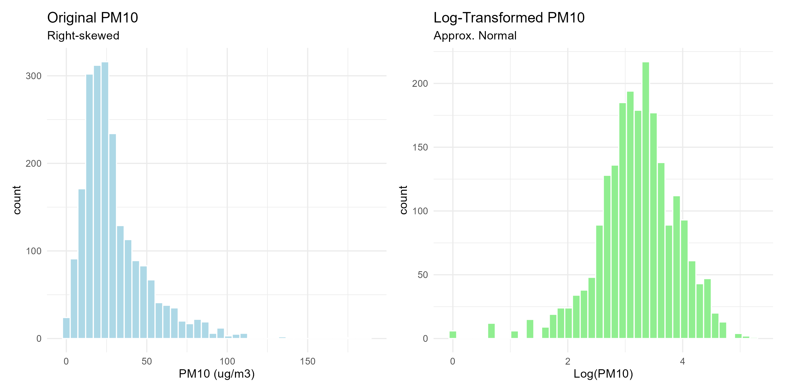
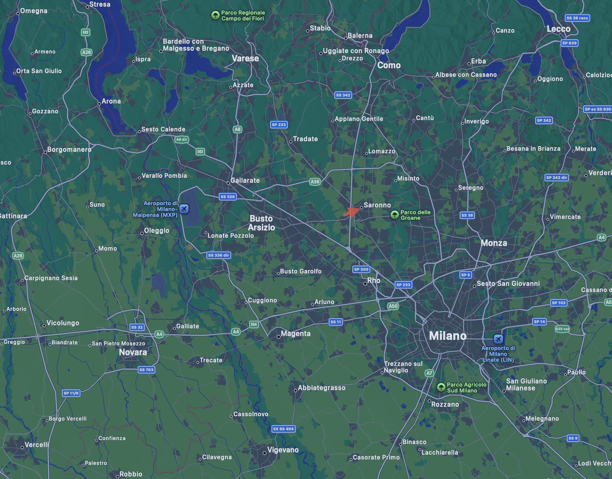
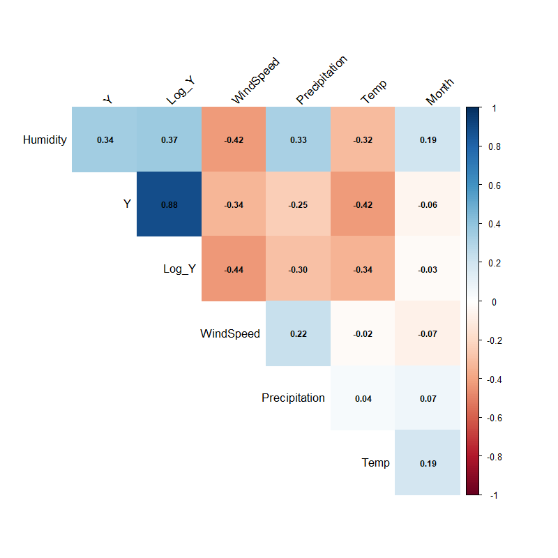

```{r setup, include=FALSE}
# ==============================================================================
# GLOBAL SETTINGS
# ==============================================================================
# echo = TRUE: Code is visible (as required by the professor).
# warning/message = FALSE: Keeps the report clean from errors/loading bars.
# fig.align = "center": Centers all plots.
knitr::opts_chunk$set(
  echo = TRUE, 
  warning = FALSE, 
  message = FALSE, 
  fig.align = "center", 
  fig.width = 10, 
  fig.height = 6
)

# Load libraries using pacman to ensure reproducibility
if (!require("pacman")) install.packages("pacman")
pacman::p_load(tidyverse, here, lubridate, knitr, kableExtra, corrplot, car, lmtest, patchwork, broom)

# Source custom functions for plotting and tables
# This keeps the Rmd file clean and readable
source(here("scripts", "02_functions.R"))
```

# 1. Project Overview and Objectives

Air pollution in the Lombardy region is a critical environmental issue due to the specific orography of the Po Valley and high industrial density.

To systematically analyze this phenomenon, we structured our research into **two distinct parts**:


Specifically, we aim to:
1.  **Meteorological Drivers of PM10**. We focus on **PM10** levels in the strategic station of **Saronno**. The goal is to build a robust regression model to quantify how natural factors (wind direction, precipitation, seasonality) influence particulate matter accumulation.
2.  **The "Covid Effect"**:  In the second stage, we will select the specific air pollutant that shows the highest correlation with industrial activity. We will then analyze whether the **COVID-19 lockdown restrictions** (Stringency Index) significantly reduced levels of that specific pollutant, treating the 2020 lockdown as a natural experiment.

# 2. Data Selection and Preparation

The analysis is based on the *Agrimonia* dataset (2016-2021). To ensure robust statistical inference, we adopted a **Time-Series approach**, fixing the spatial dimension to focus exclusively on temporal dynamics.

## 2.1 Station Selection Strategy

We performed a preliminary data quality assessment to identify the optimal station for analysis.

1.  **Missing Value Ranking:** We ranked all stations by the percentage of missing values for the target variable (PM10).
2.  **The "Ticino" Case:** The absolute best station in terms of data completeness was `Ticino_STA-CH0033A` (0.23% missing). However, this station is located in **Switzerland** (University of Lugano). Since our objective includes analyzing the impact of **Italian COVID-19 restrictions** (which differed significantly from Swiss policies), we discarded this station to ensure consistency.
3.  **Final Choice:** We selected **Saronno Via Santuario**, which ranked as the best **Italian** station for PM10 data availability.

## 2.2 Data Cleaning and Feature Engineering

The raw data was processed using an external script (`01_data_preparation.R`) to ensure reproducibility. The following preprocessing steps were applied:

1.  **Variable Exclusion:**
    *   **Emission Estimates (`EM_`)**: Removed as they are model-based proxies (often annual estimates), not direct observations. Using them to predict pollution would introduce circularity.
    *   **Static Structural Variables (`LI_`, `LA_`)**: Geographic variables (Livestock density, Land Use, Altitude) are constant over time for a single station. They have zero variance and cannot be used in a regression model (they would be perfectly collinear with the intercept).

2.  **COVID-19 Data Integration:**
    *   We integrated the *Oxford Covid-19 Government Response Tracker (OxCGRT)* dataset.
    *   We selected the **Stringency Index** for Italy, which aggregates closure policies (schools, workplaces, travel bans). Missing values (pre-2020) were imputed with `0`.

3.  **Transformations:**
    *   **Seasonality:** A categorical variable `Season` was created, with *Winter* set as the reference level.
    *   **Log-Transformation:** Pollution data is typically right-skewed. We computed $Log(Y) = \log(PM10 + 1)$ to normalize the distribution.



# 3. Geographical Context and Wind Dynamics
Saronno Via Santuario is strategically located in the Northwestern part of the Milan metropolitan area.



As shown in figure, Saronno lies at the intersection between the pre-Alpine area (to the North/West) and the high-density urban belt of Milan (to the South/East).

**Hypothesis**: We hypothesize that wind direction is a crucial determinant of local pollution:

1. **Dirty Winds**: Winds blowing from the East/South-East transport pollutants from the highly urbanized Milanese hinterland.
2. **Clean Winds**: Winds blowing from the North/West bring fresher air from the pre-Alpine regions, facilitating dispersion.
  


## 3.1 Correlation Analysis


#4 Model Results (Meteo)

```{r load_model_results, echo=FALSE}
# Qui carichiamo il modello già calcolato, invece di ricalcolarlo
m1 <- readRDS(here("output", "models", "m1_meteo.rds"))

# Stampiamo la tabella bella
tidy(m1) %>% 
  mutate(
    p.value = scales::pvalue(p.value),
    estimate = round(estimate, 4)
  ) %>% 
  kable(caption = "Meteorological Model Results") %>% 
  kable_styling(full_width = F)
```

  